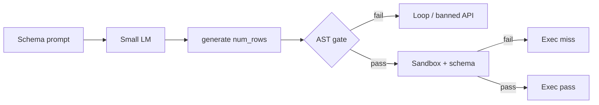

> *"When does fine-tuning help a small model write vectorized data code that actually runs—and when does it only make the code look right?"*

---

## The gap that matters

If you ask a coding model for a synthetic dataset, it will often give you a Python `for` loop. That is fine for HumanEval-style puzzles. It is a bad default for data work. Filling a million rows in the interpreter is slow; filling the same rows inside NumPy is not. So the FastData line of models is trained and prompted to behave less like a general assistant and more like a narrow compiler: take a schema in English, emit a `generate(num_rows)` function, and keep all heavy work in vectorized NumPy and Pandas—no row loops, no `.apply()`, no `.map()`, no `.iterrows()`.

The first quality bar we used for that work was an AST check. Walk the tree. Reject banned loops and banned pandas iterators. Accept only programs that *look* like vectorized generators. For a while that bar felt almost synonymous with success. On our older ten-prompt suite, programs that passed the AST check almost always ran in the sandbox too. AST pass rate and execution pass rate moved together. It was easy to talk about “90%” as if the model had learned to compile schemas into working data code.

It had not—not in the sense you would trust in CI.

**[FastData Bench](https://github.com/thlurte/fastdata-bench)** raises the second bar. One hundred prompts, ten categories, ten tasks each. Every task carries an expected schema: single table or multi-table, required column names, and explicit foreign keys where relations matter. A program only counts as Exec-pass if it defines `generate`, runs in an isolated process at a thousand rows, returns the right shape, includes the required columns, respects foreign keys, and finishes under a hard time limit (about 1.5 seconds for a single frame, 3 seconds for multi-table). Looking vectorized is still required. It is no longer sufficient.

That split—**AST** versus **Exec**—is the spine of this essay. The gap between them is where small models live. Everything below is about measuring that gap on 0.5B, 1.5B, and 3B Qwen2.5-Coder bases and their FastData-LM SFT counterparts, reading where fine-tuning helps, and being honest about where it only changes the costume.

Going in, three expectations. First: the AST–Exec gap will stay large once schemas are real. Second: SFT will raise Exec mainly by killing loop fallbacks, not by fixing every dtype, probability, and foreign-key bug. Third: at 0.5B, SFT may make answers longer and more “compiler-like,” which can truncate mid-file and *hurt* AST even when Exec inches up.



---

## How we score, and what we ran

The AST stage is deliberate and boring on purpose. Safe static iteration is allowed—looping over a short literal list of column names, or a tiny `range` used to build schema, not to walk rows. Everything else that smells like row control flow fails. Banned attribute names include the usual pandas escape hatches. This is a front-end grammar check, not a proof of semantic correctness.

The Exec stage is where semantics live. The sandbox imports the generated code, finds `generate` (or a small set of common aliases), calls it with a thousand rows, and validates the return value against the task’s schema metadata. If the task asks for one DataFrame, a dict of tables fails. If it asks for `users` and `orders` with `orders.user_id` referencing `users.user_id`, orphan keys fail. Missing required columns fail. Soft “maybe this column is a foreign key because it ends in `_id`” heuristics are not the primary path when explicit foreign-key metadata is present. Speed matters too: a vectorized claim that takes longer than the wall-clock gate fails Exec, even if the AST looked clean. We also record whether execution finished under 50 milliseconds as an informational flag; that flag does not decide pass or fail.

Failures get a coarse label from the error text: loop fallback, syntax truncation, probability vectors that do not sum to one, shape mismatches, type errors (especially around `np.char`), schema contract mistakes, missing columns, foreign-key breaks, and a residual runtime bucket for everything that does not compress cleanly.

The category mix is intentional. Categorical sampling and continuous distributions are the comfort zone of these models. Temporal arithmetic, string assembly, and correlated features add bookkeeping. Multi-table graphs, time-series style state, spatial distances, dirty-data injection, and schema-heavy aggregation are where “write vectorized NumPy” stops being a style problem and becomes a systems problem.

We evaluate the matching base and SFT checkpoints at 0.5B, 1.5B, and 3B. Same bench, same schema checks, same taxonomy. The question is not whether SFT can memorize a vibe. It is whether SFT moves Exec on a distribution hard enough that AST and Exec come apart.

---

## The scoreboard

| Model | AST | Exec | Gap | What shows up most in the failure pile |
| :--- | ---: | ---: | ---: | :--- |
| 0.5B-base | 77% | 13% | 64 pts | runtime, loops |
| 0.5B-SFT | 66% | 20% | 46 pts | **truncation (34/100)**, runtime, bad probs/shapes |
| 1.5B-base | 85% | 38% | 47 pts | runtime, loops, types, some contract misses |
| 1.5B-SFT | 85% | 48% | 37 pts | runtime, shapes, fewer loops |
| 3B-base | 80% | 47% | 33 pts | runtime, loops |
| **3B-SFT** | **91%** | **62%** | **29 pts** | runtime, some trunc/shape/type |

```chart
{
  "type": "bar",
  "title": "FastData Bench-100 — AST vs Exec",
  "caption": "Hardened schema checks open a persistent gap between looking vectorized and passing the contract.",
  "xKey": "model",
  "series": [
    { "key": "ast", "name": "AST %", "color": "#1f6feb" },
    { "key": "exec", "name": "Exec %", "color": "#bf4a2e" }
  ],
  "height": 300,
  "data": [
    { "model": "0.5B-base", "ast": 77, "exec": 13 },
    { "model": "0.5B-SFT", "ast": 66, "exec": 20 },
    { "model": "1.5B-base", "ast": 85, "exec": 38 },
    { "model": "1.5B-SFT", "ast": 85, "exec": 48 },
    { "model": "3B-base", "ast": 80, "exec": 47 },
    { "model": "3B-SFT", "ast": 91, "exec": 62 }
  ]
}
```

Read the table left to right, then read the gap column. Every row has a double-digit AST–Exec gap. The best system in this family, **3B-SFT**, still leaves nearly thirty points between “looks legal” and “passes the contract.” That is the first expectation confirmed. AST is not a proxy for deployable success on FastData Bench.

SFT at 1.5B and 3B confirms the second expectation with clean arithmetic. Exec rises **+10** at 1.5B and **+15** at 3B. Loop-labeled failures fall from 15 to 7 at 1.5B and from 19 to 2 at 3B. AST does not move at 1.5B (85% both ways) and improves at 3B (80%→91%). Fine-tuning is doing real work: it pushes probability mass away from CPython loops and toward the house style of `generate` plus array ops. It is not magically installing a full schema verifier in the weights.

The 0.5B row is the third expectation in pure form. Exec crawls from 13% to 20%. AST drops from 77% to 66%. Thirty-four prompts die as truncated syntax—unfinished strings, unfinished list literals, files that end mid-thought. Average generation time blows up from a few seconds to about twenty. The model becomes more verbose under the compiler-facing prompt, burns the token budget, and fails before the sandbox ever gets a fair chance. If you only watched Exec, you might call SFT a small win. If you watched AST and the error mix, you would call it a regression with a silver lining.

Latency on the successful paths is not the story; decode length is. Bases answer shorter. SFT answers longer. At 3B that length often finishes. At 0.5B it often does not.

---

## Where categories break the average

Averages hide the terrain. Continuous and heavy-tailed sampling (CONT) is already strong by 1.5B and essentially saturated at 3B—both base and SFT clear it. That matches intuition: `np.random.normal`, `lognormal`, `pareto`, `clip` are close to what coder models already know how to emit.

Time tasks are different. Exec on TIME jumps under SFT—from 30% to 70% at 1.5B, from 50% to 80% at 3B. The model learns to keep dates in `datetime64` / timedelta space instead of inventing row-wise Python datetimes. Correlation-style tasks also move at 3B. These are places where supervised vectorized demos transfer.

Relational multi-table tasks are the clearest proof that AST and Exec measure different things. At 3B-SFT, REL can sit at **100% AST** and still land around **40% Exec**. The model has learned the *shape* of the answer: return a dict of DataFrames, sample child keys from parent key arrays. It has not reliably learned referential integrity, or it still trips on runtime details after the skeleton looks right. Teaching the costume of a multi-table generator is easier than teaching the invariant that every foreign key must exist in the parent.

Schema-heavy and time-series categories stay near the bottom. Aggregations, ledger-style constraints, and sequential state are exactly where bases reach for loops, and where SFT’s anti-loop prior is not enough to guarantee correct cumulative logic. Dirty-data tasks often pass AST and then fail on mask shapes or quiet logic bugs. Spatial tasks punish broadcast mistakes: a distance that “looks vectorized” can still blow up on `(n,)` versus `(n,1)`.

String assembly sits in the middle. `np.char` is unforgiving about dtypes. Models cast too late, or not at all, and Exec fails with a type error the AST never saw.

If you only remember one stratified fact, make it this: **SFT buys the most on temporal and “format” wins; it struggles most where the bench checks relationships and long-horizon structure.** CONT is not evidence that the problem is solved. REL and SCH are evidence that it is not.

---

## What actually goes wrong

Loop fallback is still the base-model disease. Ask for something that smells like “the next state depends on the last,” or “for each point find the nearest depot,” and an untuned coder reaches for `for`. That is rational in ordinary Python and fatal under our grammar. SFT at 3B nearly deletes this mode. That is the cleanest causal story in the whole matrix: supervised vectorized targets move the prior, and LOOP counts collapse.

Truncation is the 0.5B-SFT disease. It is not that the model prefers invalid syntax. It is that it starts a long, commented, step-by-step generator and never closes the last bracket. Raising generation length helps until it does not; verbosity learned from “be a careful compiler” fights the budget. Length has to become a training concern for tiny models, not only an eval flag.

Then there is the Exec-only swamp—the failures that prove why we hardened the bench. Probabilities passed to `np.random.choice` without renormalization. `np.char.add` on integer arrays. Broadcast errors in geometry and correlation code. Returning one flat frame where the task required a dict of tables. Missing a required column while inventing three optional ones. Foreign keys that point at IDs that were never emitted in the parent. None of these trip the AST walker. All of them fail a data contract. On the old suite, many of these never appeared because the tasks did not demand the contract.

Residual “runtime other” remains large even for 3B-SFT. That is unsatisfying and honest. Not every exception compresses into a neat label. The important point is directional: as LOOP shrinks, the remaining mass is semantic and environmental, not stylistic.

We should also retire a tempting narrative from the ten-prompt era without erasing it. Yes, we saw a sharp SFT lift at 3B when AST ≈ Exec and the suite was small. Yes, sub-3B SFT could look like a capacity squeeze. Those observations still inform training. They do not entitle anyone to quote “3B-SFT ≈ 90%” as the operating number under FastData Bench. Under hardened checks, **3B-SFT is 91% AST and 62% Exec**. The useful restatement of the old “knee” is narrower: at 3B, fine-tuning reliably improves Exec and almost removes loops. That is a real scaling claim. It is not a claim that the compiler is done.

Self-repair from stack traces remains a poor crutch at these sizes. In earlier work, multi-turn “here is the traceback, fix line N, no loops” repair was effectively zero for sub-3B models. They thrash names, reintroduce loops, or fix one error by creating another. FastData Bench does not change that diagnosis.

---

## Closing

The limit of small language models in this setting is not that they cannot learn vectorization as a style. They can. On FastData Bench-100, AST rates in the high seventies to low nineties are normal. The limit is that **style is cheap and contracts are expensive**. Fine-tuning at 1.5B and especially 3B pays down the style debt—loops fall, Exec rises, the gap narrows but does not close. At 0.5B, the same fine-tuning can tax you in truncated files. Across the board, the failures that remain after the grammar check are exactly the failures a real data pipeline would reject: shapes, types, probabilities, columns, keys.

So the honest summary is small enough to repeat. **AST pass means the program looks like our compiler. Exec pass means it behaved like one.** On the hardened hundred-task bench, those are different events. The best checkpoint in this study, FastData-LM-3B-SFT, reaches 91% and 62%. That is progress worth shipping as a research artifact and a model card. It is not a solved neural compiler.

---

```bibtex
@article{ahmed2026limits,
  title   = {On the Limits of Small Language Models in Vectorized Code Synthesis},
  author  = {Ahmed},
  journal = {thlurte.github.io},
  year    = {2026},
  url     = {https://thlurte.github.io/research/limits-of-small-models-in-vectorized-code-synthesis/}
}
```

[Failure modes of weight-space merging](/research/failure-modes-of-model-merging-in-neural-code-synthesis/) · [FastData Bench](https://github.com/thlurte/fastdata-bench) · [gnoril](https://github.com/thlurte/gnoril)
